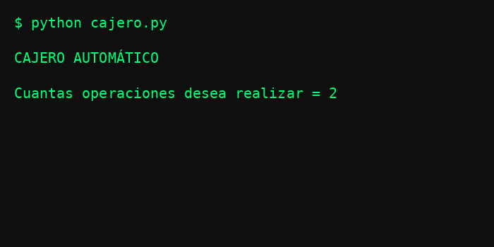

# 🏧 Simulador de Cajero Automático en Python

Este proyecto es un **simulador básico de cajero automático** desarrollado en **Python**, que permite al usuario realizar diferentes operaciones bancarias desde la terminal.

El programa simula el funcionamiento de un cajero donde el usuario puede consultar su saldo, retirar dinero y depositar dinero.

----

## 🚀 Funcionalidades

El sistema permite realizar las siguientes operaciones:

-   💰 **Consultar saldo**
    
-   💸 **Retirar dinero**
    
-   🏦 **Depositar dinero**
    
-   🔁 **Realizar múltiples operaciones**
    
-   ⚠️ **Validación de montos inválidos**
    
-   ❌ **Mensaje cuando la opción ingresada es incorrecta**

----
    
## 🧠 Lógica del programa

El programa funciona de la siguiente manera:

1.  Se establece un **saldo inicial**.
    
2.  El usuario indica **cuántas operaciones desea realizar**.
    
3.  En cada operación se muestra un **menú de opciones**.
    
4.  Dependiendo de la opción elegida, el sistema ejecuta:
    
    -   Consulta de saldo
        
    -   Retiro de dinero (validando fondos suficientes)
        
    -   Depósito de dinero (validando que el monto sea positivo)
        
5.  El saldo se **actualiza después de cada operación**.

----
    
## 📂 Tecnologías y conocimientos utilizados

-   **Python**
    
-   Programación estructurada
    
-   Uso de:
    
    -   `if / elif / else`
        
    -   `for`
        
    -   `while`
        
    -   `input()`
 
    -   `print()`
        
    -   Variables
 
----
        
## ▶️ Cómo ejecutar el proyecto

1️⃣ Clona el repositorio:

```bash
git clone https://github.com/tuusuario/simulador-cajero-python.git
```
2️⃣ Entra a la carpeta del proyecto:

```bash
cd simulador-cajero-python
```
3️⃣ Ejecuta el programa:

```bash
python main.py
```
### ⚠️ Requisitos

Para ejecutar este programa es necesario tener Python 3 instalado en el computador.

Puedes descargarlo desde el sitio oficial:

[Descargar Python](https://www.python.org/downloads/) 

---

## 📌 Ejemplo de uso

CAJERO AUTOMÁTICO  
  
Cuantas operaciones desea realizar = 2  
  
OPERACIONES QUE PUEDE REALIZAR  
1 → Consultar saldo  
2 → Retirar dinero  
3 → Depositar dinero  
  
Escoge la opcion a realizar = 1  
El saldo actual es 1000

## 🎥 Demo



----

## 🎯 Objetivo del proyecto

Este proyecto fue creado con el objetivo de **practicar lógica de programación en Python**, simulando el funcionamiento básico de un sistema de cajero automático.

----

## 👨‍💻 Autor

Este proyecto fue creado por **[Isaac Guzmán Mora](https://github.com/Isaac-G17)**.


